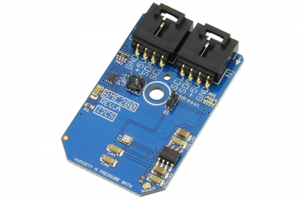

# BME280

The BME280 is a combined humidity, pressure and temperature sensor that allows for two devices per I2C port.

The humidity sensor in the BME280 provides an extremely fast response time and high overall accuracy with ±3%RH.The pressure sensor in this device is an absolute barometric pressure sensor with extremely high accuracy and resolution and low noise output. The temperature sensor has been optimized for the lowest noise and highest resolution and is used for temperature compensation of the pressure sensor and can also be used for estimation of ambient temperature. Measurements with the BME280 can be performed by the user or performed in regular intervals.
This Device is available from www.ncd.io 

[SKU: BME280_I2CS]

(https://store.ncd.io/product/bme280-digital-humidity-%C2%B13rh-pressure-and-temperature-sensor-i2c-mini-module/)
This Sample code can be used with Arduino.

Hardware needed to interface BME280 sensor with Arduino

1. <a href="https://store.ncd.io/product/i2c-shield-for-arduino-nano/">Arduino Nano</a>

2. <a href="https://store.ncd.io/product/i2c-shield-for-arduino-micro-with-i2c-expansion-port/">Arduino Micro</a>

3. <a href="https://store.ncd.io/product/i2c-shield-for-arduino-uno/">Arduino uno</a>

4. <a href="https://store.ncd.io/product/dual-i2c-shield-for-arduino-due-with-modular-communications-interface/">Arduino Due</a>

5. <a href="https://store.ncd.io/product/bme280-digital-humidity-%C2%B13rh-pressure-and-temperature-sensor-i2c-mini-module/">BME280 pressure,humidity and temperature Sensor</a>

6. <a href="https://store.ncd.io/product/i%C2%B2c-cable/">I2C Cable</a>

BME280:

The BME280 is a combined humidity, pressure and temperature sensor that allows for two devices per I2C port.The humidity sensor in the BME280 provides an extremely fast response time and high overall accuracy with ±3%RH. The pressure sensor in this device is an absolute barometric pressure sensor with extremely high accuracy and resolution and low noise output. The temperature sensor has been optimized for the lowest noise and highest resolution and is used for temperature compensation of the pressure sensor and can also be used for estimation of ambient temperature. Measurements with the BME280 can be performed by the user or performed in regular intervals.
Applications:

• Context awareness, e.g. skin detection, room change detection

• Health monitoring / well-being

   • Warning regarding dehydration or heat stroke

   • Spirometry (measurement of lung volume and air flow)

• Home automation control

   • control heating, venting, air conditioning (HVAC)

• Internet of things

• GPS enhancement (e.g. time-to-first-fix improvement, dead reckoning, slope detection)

• Indoor navigation (change of floor detection, elevator detection)

• Outdoor navigation, leisure and sports applications

• Weather forecast

• Vertical velocity indication (rise/sink speed)

How to Use the BME280 Arduino Library
The BME280 is very easy to interface as following.

1.Address calling:The following command is used to call the address of BME280 to start the transmission.

            bme.getAddr_BME280(BME280_DEFAULT_ADDRESS);  

2.Pressure measurement:The following command is used to measure the pressure in hPa.            
            
            bme.bme_sensorData.P/100.0

3.Temperature measurement:The following command is used to measure the temperature in celcius.

            bme.bme_sensorData.T
            
4.Humidity measurement:The following command is used to measure the humidity in %.

            bme.bme_sensorData.H
